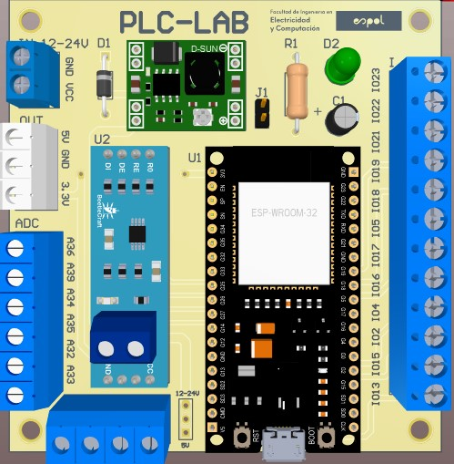

# ESP32-PLC

## Modulo RS485
| Name      | Pin      |
|-----------|----------|
| RO        | GPIO_25        
| RE        | GPIO_26     
| DE        | GPIO_27   
| DI        | GPIO_14 

## PCB:
 

 
